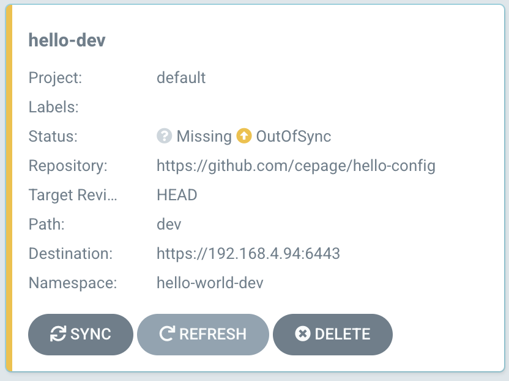
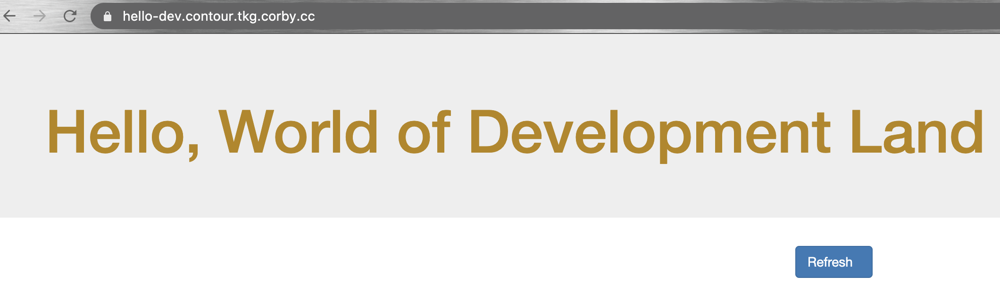

# Tanzu DevOps/CD Demo

This is the DevOps/CD demo with Tanzu technologies that is shown in this video: 
[](http://www.youtube.com/watch?v=jRBGQ3Jhrgw "CI/CD and DevOps with Tanzu")

# Prerequisites

You will want at least one running Kubernetes cluster to install and run the demo. These assets have been tested with TKG Standalone (TKG) and TKG Integrated (TKGI).

This document will refer to a **Shared Services Cluster**, which will control the build and deployment pipelines, and a **Workload Cluster**, which will run the user applications that we build and deploy. The Shared Services Cluster and the Workload cluster could be a single cluster if you are tight on demo resources, but in practice a single Shared Services cluster would service many external Workload Clusters.

For ease of execution, it is recommended that you support Load Balancer capability on each of your clusters. If you are running your TKG cluster in a cloud environment, or with integrated NSX-T, then you have Load Balancer support. If not, it is recommended that you install **MetalLB** with Layer2 Configuration to add LoadBalancer support. This is an extremely simple process that can be completed in minutes:
* Installation: https://metallb.universe.tf/installation/#installation-by-manifest
* Layer2 Configuration: https://metallb.universe.tf/configuration/#layer-2-configuration

# Installation

1. Install ArgoCD onto the Shared Services cluster. It's a simple install, and the instructions are here: https://argoproj.github.io/argo-cd/getting_started/. If your workload cluster is separate from the Shared Services cluster, you must register the workload cluster as described here: https://argoproj.github.io/argo-cd/getting_started/

2. Install Tanzu Build Service onto the Shared Services cluster. This is the most complicated installation piece, and documentation is here: https://docs.pivotal.io/build-service/0-2-0/index.html. This installation process includes configuring the Docker repository that build service will be publishing images to (and that our deployment engine will be pulling from).

3. Attach your Workload cluster to Tanzu Mission Control. Log into Mission Control and press the Attach Cluster button. Enter information about your Workload cluster, and follow the instructions for installing the agent.

4. Install Contour onto the Workload cluster.
* Base install is as simple as applying a manifest: ``kubectl apply -f https://projectcontour.io/examples/kuard.yaml``
* Create a wildcard A record that maps your application domain (e.g. *.apps.mydomain.com) to the LoadBalancer address for the **envoy** service in the **projectcontour** namespace
* Configure TLS support. Generate a cert (LetsEncrypt or self-signed) and execute the following command: ``kubectl create secret tls tls-secret --cert=<your cert> --key=<your private key> -n projectcontour``. Then enable TLS Delegation by running a ``kubectl apply -f`` on the following file:
```
apiVersion: projectcontour.io/v1
kind: TLSCertificateDelegation
metadata:
  name: contour-delegation
  namespace: projectcontour
spec:
  delegations:
    - secretName: contour-tls
      targetNamespaces:
        - "*"
```

# Configure Deployments

Create a personal fork of the following config repos in Github:
* https://github.com/cepage/hello-config
* https://github.com/cepage/world-config

Customize your fork of the repos for your environment:
* Update your version of the files hello-config/base/deployment.yaml and world-config/base/deployment.yaml. Each of these files specifies an image name that uses the registry prefix **harbor-lab.pks.corby.cc/development**. Replace the prefix with the docker registry/project that you will be using.
* Update your version of the files hello-config/dev/httpproxy.yaml and hello-config/staging/httpproxy.yaml. Each of these files specify a FQDN that uses the base domain **contour.tkg.corby.cc**. Replace the base domain portion with the wildcard domain that you created during Contour installation (e.g. hello.apps.mydomain.com)

### Build Service

Set up build using Tanzu Build Service. Set your current context to the Shared Services Cluster, and run the following:
```
kp image create world <your docker registry>/hello --namespace build-service --git https://github.com/cepage/hello
kp image create world <your docker registry>/world --namespace build-service --git https://github.com/cepage/world
```
The ``<registry>/hello`` and ``<registry>/world`` paths should match the image names you entered when you customized the ``deployment.yaml`` files in your forked repos.

This will kick off builds of the hello and world microservices. You can check the status of the builds with the following commands:
```
kp build logs hello -b 1
kp build logs world -b 1
```

### ArgoCD

Log into ArgoCD, and click the New App button in the Upper Left corner. Fill out the following fields:
> Application Name: hello-dev<br>
> Project: default<br>
> Repository URL: [Your forked version of the hello-config Github Repo]<br>
> Path: dev<br>

Hit the Create Button. Repeat the process and create the following 3 additional apps:

> Application Name: world-dev<br>
> Project: default<br>
> Repository URL: [Your forked version of the world-config Github Repo]<br>
> Path: dev<br>

> Application Name: hello-staging<br>
> Project: default<br>
> Repository URL: [Your forked version of the hello-config Github Repo]<br>
> Path: staging<br>

> Application Name: world-staging<br>
> Project: default<br>
> Repository URL: [Your forked version of the world-config Github Repo]<br>
> Path: staging<br>

Your apps will now show on the home page as "Out of Sync" (assuming you selected the default Manual Sync Policy):


Press the Sync button on the app, and ArgoCD will deploy to your Kubernetes cluster, to match the configuration defined in your forked config repos. Once all four apps have been synced, you can visit the FQDNs that you specified in your Contour HttpProxy configurations, and see the running Dev and Staging deployments of the application:


